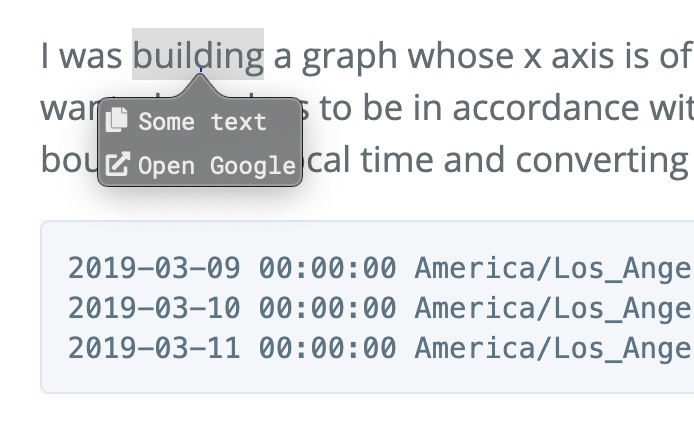

Make the provider script
=========================

### TL;DR 

* The provider script is an executable binary at `~/Library/Application\ Scripts/tanin.tip/provider.script` that prints JSON on stdout
  * The directory is `~/Library/Application\ Scripts/tanin.tip`, and the file is `provider.script`.
* The provider script is executed by Tip when activated
* Don't forget to `chmod 755 ~/Library/Application\ Scripts/tanin.tip/provider.script`
* Use hard link, not symbolic link (i.e. `ln -s`), because Tip runs in [App Sandbox](https://developer.apple.com/app-sandboxing/) and can't follow a symbolic link to a file outside the predefined directory, which is `~/Library/Application\ Scripts/tanin.tip/`.
  * Some text editors write to temp file and rename. Be careful with the hard link not being updated.
* Lastly, don't forget to enable Tip:
  * Go to System Preferences > Keyboard > Shortcuts > Services > Scroll down to the "Text" section. You should see "Tip: open tips" under the "Text" section. Please make sure to check it.


Example
--------

Here's `~/Library/Application\ Scripts/tanin.tip/provider.script` written in Ruby:

```ruby
#!/usr/bin/env ruby

require 'json'

def main(input)
  items = [
    {type: 'text', value:'Some text'},
    {type: 'url', label:'Open Google', value: "https://google.com/search?q=#{input}", autoExecuteIfFirst: true}
  ]

  puts items.to_json
end

if __FILE__ == $0
  main(ARGV[0])
end
```

From the script above, when activating Tip, we'll see:




Output JSON Spec
-----------------

For text, it must contains `"type": "text"` and the field `value`.

For URL, it must contains `"type": "url"` and the fields `label` and `value`.

For execute, it must contains `"type": "execute"`, the field `label`, and the array `args`. When the item is selected, Tip will execute `./provider.script [args]`.

`autoExecuteIfFirst` is an optional field. If the value is `true` and the item is the first one, we execute the action immediately.

The JSON must be an array that looks like below:

```json
[
  {"type": "text", "value": "Some text"},
  {"type": "url", "label": "Go to JIRA", "value": "https://your-jira-url/JIRA-0001", "autoExecuteIfFirst": true},
  {"type": "execute", "label": "Run something", "args": ["--execute", "some-more-arg"]},
]
```

Happy programming!


Debugging Tips
---------------

* Try running `~/Library/Application\ Scripts/tanin.tip/provider.script [some-input] --bundle-id [some-bundle-id]` in Terminal to see if it works correctly
* Open Console.app and set filter Process=Tip. The logs from Tip will show up.


Examples of provider scripts
-----------------------------

* [Ruby](./scripts/provider.script)
* [Python](./scripts/provider.script.py)
* [Rust](https://github.com/hobofan/tippytap)

As a reminder, please always inspect the source code of a provider script before using it.
